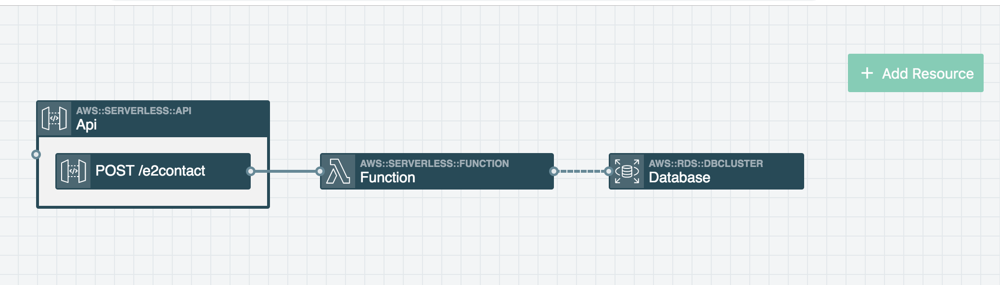

# Jim's First Stackery Project!


This Function was generated by [Stackery.io](https://www.stackery.io).


This was generated via the stackery cli:
```
stackery init --stack-name evaluates2-site
```

```
cd evaluates2-site
```

```
stackery edit
```

This runs a local server which allows you to edit your tech stack as a diagram of connected nodes like so:




Changing your diagram should then update the template.yaml (AWS SAML configuration file), and updates to this template file should reflect in your digram as well. 

Especially when you have complex flows of data, stackery can help you take a step back and better visualize your cloud architectures.


# Stackery Documentation
Documentation for Function resources can be found at [https://docs.stackery.io/docs/api/nodes/Function](https://docs.stackery.io/docs/api/nodes/Function/).
